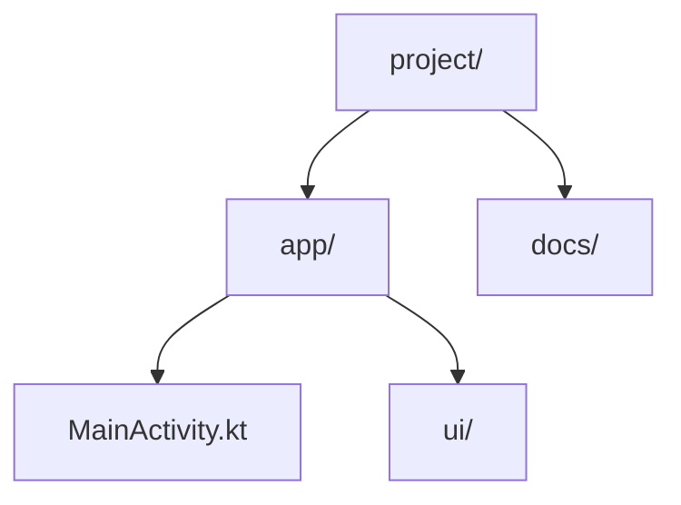
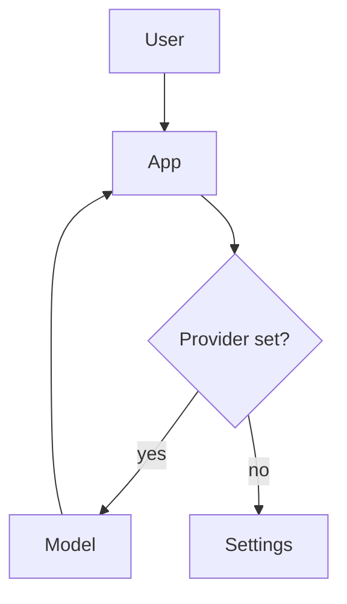

PhoneCode renders Mermaid diagrams inline in the chat. To show a diagram, output a single fenced code block with the `mermaid` language tag and valid Mermaid syntax. The app draws it; you do not need to describe the picture in words as well.

Rules:
- One `mermaid` block per diagram. Keep the syntax valid: a syntax error renders as an error message, not a picture.
- Pick the diagram type that fits:
  - Tree, hierarchy, org chart, or file tree: `graph TD` with `parent --> child` edges.
  - Dependency or relationship graph: `graph LR` or `graph TD`; label edges with `-->|label|`.
  - Process or control flow: `flowchart TD` with decision nodes `{...}` and labelled branches.
  - Interactions over time: `sequenceDiagram`. States: `stateDiagram-v2`. Data model: `erDiagram`. Classes: `classDiagram`.
- Quote node text that has spaces or punctuation: `A["read file"]`.
- Keep a diagram focused (roughly under 40 nodes) so it stays legible on a phone.

A file tree:

A request flow with a decision:

